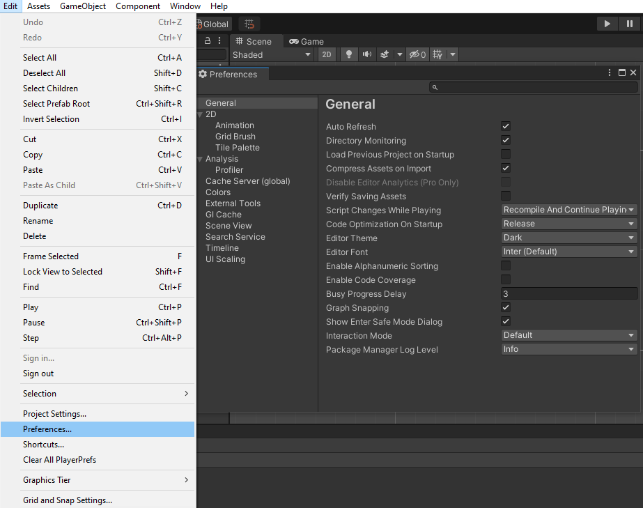

# 🕹 Занятие 2: первая игра - Roll a Ball


Перед началом смотри [создание проект](./#sozdanie-svoego-pervogo-proekta)


## Идея

Сделаем простую игру где можно будет двигать шар :soccer: по горизонтали и вертикали чтобы подбирать раскиданные по локации кубики :ice\_cube: и ограничить его передвижение стенами.

## Создание уровня

Нам нужно создать на сцене несколько кубов, трансформировать их и расставить их по уровню


Сцена - это контейнер, в котором находятся все игровые объекты на уровне


По умолчанию у нас уже открыта сцена под названием <mark style="color:green;">SampleScene.</mark>\
Все объекты на сцене в виде иерархии можно увидеть в окне Hierarhy в левой части экрана, там уже создано два объекта: <mark style="color:green;">Main Camera</mark> (_камера, из которой игрок видит локацию_) и <mark style="color:green;">Directional Light</mark> (_глобальное освещение которое симулирует солнце в игре_).

.png>)

### Стены

Чтобы добавить новый объект на сцену нужно кликнуть правой кнопкой мыши в пустое место иерархии и выбрать какой именно объект хотим создать, в нашем случае <mark style="color:green;">3D Object -> Cube</mark>\
После этого куб появится не только в иерархии, но и на сцене\
Чтобы приблизиться к нему нужно выбрать его в иерархии и наведя мышь на окно <mark style="color:green;">Scene</mark> нажать клавишу <mark style="color:green;">**F**</mark>

 (1).png>)

В данным момент выбран инструмент перемещения, который позволяет в помощью стрелок передвигать выбранный объект

Для изменения пропорций куба нужно выбрать инструмент <mark style="color:green;">Scale</mark> в верхней в части редактора

 (1).png>)

Теперь при зажатие стрелок куб не перемещается, а расширяется в определенную сторону

Создадим еще 3 куба и сделаем замкнутую стену


Чтобы дублировать выбранный объект нужно нажать <mark style="color:green;">Ctrl + D</mark>


Для вращения используется инструмент <mark style="color:green;">Rotate</mark>

 (1).png>)


Для поворота ровно на 15 градусов нужно зажать <mark style="color:green;">Ctrl</mark> во время вращения


Результат выглядит следующим образом:

 (1).png>)

### Пол

Осталось только добавить пол: создадим объект 3D Object -> Plane, масштабируем его и переместим в центр

 (1) (1).png>)

### Инспектор

Трансформировать объекты можно не только с помощью инструментов редактора, но и в окне инспектора

.png>)

Помимо <mark style="color:green;">Transform</mark> объекта мы видим также другие компоненты: <mark style="color:green;">Renderer, Collider, Filter</mark>. Для чего они нужны мы рассмотрим позже. Важно запомнить что Transform есть на любом объекте и его нельзя убрать.


Компонент - составная часть объекта, которая добавляет ему определенные возможность


### Сфера

Для начала добавим его на сцену <mark style="color:green;">3D Object -> Sphere</mark>

.png>)

Теперь поменяем ей цвет, для этого потребуется создать новый материал в окне <mark style="color:green;">Project</mark> - там хранятся все ресурсы нашей игры (_модели, материалы, скрипты_). Для этого нужно начать правой кнопкой в любом свободном месте окна и выбрать Create -> Material\
После этого он появится в списке ресурсов проекта:

.png>)

Выберем его и в Инспекторе поменяем цвет Albedo (_основная текстура_)

&#x20;

.png>)

Для применения материала просто перетащим его на шар

 (1).png>)

Давайте рассмотрим набор компонентов сферы:

* <mark style="color:green;">Tranform</mark> - находится на любом объекте и служит для изменения положения, вращения и масштаба объекта
* <mark style="color:green;">Mesh Filter</mark> и <mark style="color:green;">Renderer</mark> - необходимы для фильтрации и построения исходного набора полигонов, который есть у каждой 3D модели, а также наложения материала на нее
* <mark style="color:green;">Sphere Collider</mark> - коллайдеры служат для просчета столкновений объектов и не позволяют им заходить друг в друга. Префикс Sphere означает что коллайдер сферической формы.

Однако если запустить игру, то все объекты находятся на своих местах, ничего не падает по физике и не сталкивается.

Для работы **физики** в Unity на конкретном объекте есть компонент <mark style="color:green;">Rigidbody</mark> - он необходим для работы гравитации, столкновений, а также триггеров.\
Чтобы его добавить в списке компонентов нажмем на кнопку <mark style="color:green;">Add Component</mark>, найти его в списке и выбрать. После этого он окажется на объекте с настройками по умолчанию

 (1).png>)

.png>)

### Камера

Однако если перейди во вкладку <mark style="color:green;">Game</mark> можно увидеть что камера направлена совсем не на сцену\
Чтобы направить камеру на нашу сцену можно либо использовать использовать инструменты вращения и перемещения

.png>)

Либо же выровнять камеру в соответствии с обзором в окне Scene: для этого выберем камеру и в верхнем меню нажмем кнопку <mark style="color:green;">Object -> Align With View</mark>

После этого на вкладке <mark style="color:green;">Game</mark> обзор игрока будет следующим:

.png>)

### Цели для игрока

По примеру выше вы должны создать небольшой куб с материалом <mark style="color:blue;"><mark style="color:purple;">синего<mark style="color:purple;"></mark> цвета

 (1).png>)

## Введение в программирование

### Функции жизненного цикла MonoBehaviour

Это функции, который вызывает сам <mark style="color:green;">Unity</mark> у всех классов, которые наследуются от <mark style="color:green;">MonoBehaviour</mark>

#### Awake

Всегда вызывается перед функцией <mark style="color:green;">Start</mark>\
Обычно используется для настройки основных зависимостей (_если текущий скрипт использует другие компоненты_)

#### Start

Вызывается после загрузки сцены перед первым кадром\
Обычно используется для задания стартовых значений параметров либо же трансформации (_перемещение, вращение, масштаб_)

#### Update

Вызывается один раз за кадр до обновления кадра - **привязан к производительности игры**\
Обычно используется для системы ввода и проверки значений в других скриптах благодаря чему минимизируются задержки в работе игры


Не рекомендуется проводить дорогостоящие операции, такие как изменение физических параметров каждый кадр. Это оказывает значительное влияние на производительность


#### FixedUpdate

Вызывается каждый раз перед обновление физики - **почти не привязан к производительности** \
Рекомендуется перемещение и изменение физических свойств объекта переносить именно сюда для более корректно просчета


В <mark style="color:green;">FixedUpdate</mark> умножать скорость на <mark style="color:green;">Time.deltaTime</mark> не требуется, т.к. время между обновлением физики почти одинаково


#### LateUpdate

Вызывается перед отрисовкой кадра, но после всех функций обновления (<mark style="color:green;">Update, FixedUpdate</mark>)

#### OnEnable

Вызывается при включении текущего компонента и при старте игры, если компонент в этот момент включен.

#### OnDisable

Вызывается при выключении текущего компонента, объекта, уничтожении объекта или удалении компонента с него.

### Постоянное вращение целей

Для создания нового скрипта нужно нажать ПКМ в окне <mark style="color:green;">Project -> Create -> C# Script</mark> и перетащите его на объект или же нажать <mark style="color:green;">Add Component</mark> на объекте, ввести его название и нажать <mark style="color:green;">New Script -> Create and Add.</mark>

.png>)

Чтобы открыть созданный скрипт можно просто дважды нажать на него.

По умолчанию он выглядит следующим образом:

.png>)

Можно увидеть что был создал **C# класс**, который унаследован он <mark style="color:green;">MonoBehaviout</mark> - позволяет использовать методы жизненного цикла и добавлять скрипт на объект.&#x20;

По умолчанию уже определено два метода жизненного цикла, которые являются приватными (<mark style="color:green;">private</mark>).

Теперь нужно реализовать постоянное вращение - бесконечно поворачивать объект на определенный угол.\
Во вращение и перемещении нам помогает свойство <mark style="color:green;">transform</mark>, которое если у любого <mark style="color:green;">MonoBehaviout</mark>, которое позволяет получить доступ к компоненту <mark style="color:green;">Tranform</mark>.\
Для вращения объекта используется метод <mark style="color:green;">Rotate</mark>, который принимает поворот в трех координатах - <mark style="color:green;">X, Y, Z</mark>. Просто добавим его в функцию <mark style="color:green;">Update</mark> и получим постоянное вращение.

.png>)

### Вынос параметров скрипта в инспектор

Мы определи постоянное вращение в 5 градусов по оси Z, но что если геймдизайнер захочет изменить скорость или ось для вращения? Лезть в код и менять не вариант, ведь один и тот же скрипт может использоваться сразу на нескольких объектах

В Unity для скриптом можно указывать параметры, которые являются уникальными и способствуют повторному использованию уже написанных компонентов.\
Для этого в классе нужно определить **публичное поле...**\
****

.png>)

**...**и Unity автоматически отобразит его в <mark style="color:green;">Инспекторе</mark> на компоненте

.png>)

Тип <mark style="color:green;">Vector3</mark> используется для задания значения по трем осям, каждое из которых представляет значение типа <mark style="color:green;">float</mark>.

Изменим код вращения, использовав поле <mark style="color:green;">RotationSpeed</mark>

.png>)

Теперь у каждого объекта со скриптом <mark style="color:green;">ConstantRotator</mark> можно будет указать свою _уникальную_ скорость вращения.

### Управление мячом

### Триггеры

